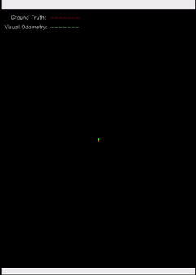
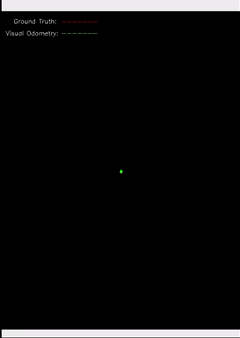

# VO-optimization

### Getting Started

Requirements:
* Python 3.7
* OpenCV
* NumPy
* CuPy
* Pandas

Creating a conda environment
```
conda env create -f environment.yml
```

To run the code
```
python main_vo.py
```

To use a different data set make sure to follow the file structure:
```
VO-optimization
├── data
│   └── kitti06
│       ├── 06.txt
│       ├── groundtruth.txt
│       └── video.mp4
├── environment.yml
├── fundamental_matrix.py
├── main_vo.py
├── README.md
├── results
└── utils.py
```

### Overview of the custom functions: [Visual Odometry](https://hackmd.io/@v5q4XBUKQ9yqQknjP1uFrw/HJlnp6r_q)

### Results

||Builtin OpenCV Functions| Non Optimized (NumPy)| CuPy Optimized| PyTorch Optimized-1| PyTorch Optimized-2|
|:---:|:---:|:---:|:---:|:---:|:---:|
|Plots| |  | || 
|Feature Detection and Tracking Time| 85.58s |85.28s| 85.52s | 83.26s | 89.35s|
|F Computation using RANSAC Time| 7.68s   | 925.36s|231.85s | 51.03s | 6.50s |
|Pose Recovery Time| 11.44s   |13.58s| 13.48s | 10.68s | 12.25s |
|Plot Time| 13.89s   | 13.31s| 12.87s | 13.26s | 16.13s |
|Runtime | 118s   |  1037s | 341s | 158s | 124s |
<!-- |Translation Error (RMS)| | | |
|Rotational Error (RMS)||| | -->
